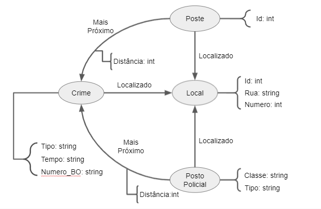

# Lab07 - Modelo Lógico para Banco de Dados de Grafos

Estrutura de pastas:

├── README.md  <- arquivo apresentando a tarefa  
│  
└── images     <- arquivos de imagem usados na tarefa  

# Aluno
* 214017: Bruno Henrique Emidio Leite

## Modelo Lógico do Banco de Dados de Grafos

## Perguntas de Pesquisa/Análise
