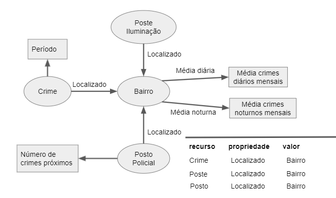

# Lab09 - Grafos de Conhecimento

Estrutura de pastas:

├── README.md  <- arquivo apresentando a tarefa  
│  
└── image     <- arquivo de imagem usado na tarefa  

# Aluno
* 214017: Bruno Henrique Emidio Leite

## Exemplo de Grafo de Conhecimento - para publicar

O modelo de grafo de conhecimento teria as três triplas indicadas acima, em que o recurso poderia variar entre "Crime", "Posto Policial" e "Poste de Iluminação" enquanto a propriedade e valor seriam iguais para os três: "Localizado" e "Bairro", respectivamente.
Nos bairros foram adicionados os nós literais "Média de crimes diários mensais" e "Média de crimes noturnos mensais", os quais facilitariam a visualização para os casos de iluminação pública falha. Nos crimes, foi adicionado o "Perído do dia", facilitando a diferenciação dos crimes mais comuns diários e noturnos. Além disso, é adicionado o nó literal "Número de crimes próximos" para a visualização dos postos que possuem mais crimes em suas redondezas.

## Perguntas de pesquisas

> Qual o aumento de crimes durante o período noturno em um bairro?

Através da diferença da média, é possível observar casos em que a iluminação pública não está sendo eficiente caos haja um aumento significativo.

> Quais postos possuem mais crimes acontecendo em locais próximos?

Útil para a identificação dos postos policiais que não conseguem proteger completamente uma área e locais que poderiam ter mais postos.

> Existe uma diferença entre os crimes são mais comuns de dia e de noite?

Uma análise útil para os agnetes de segurança do local para que eles consigam realizar uma abordagem efetiva para a diminuição de crimes dependendo do período do dia.
